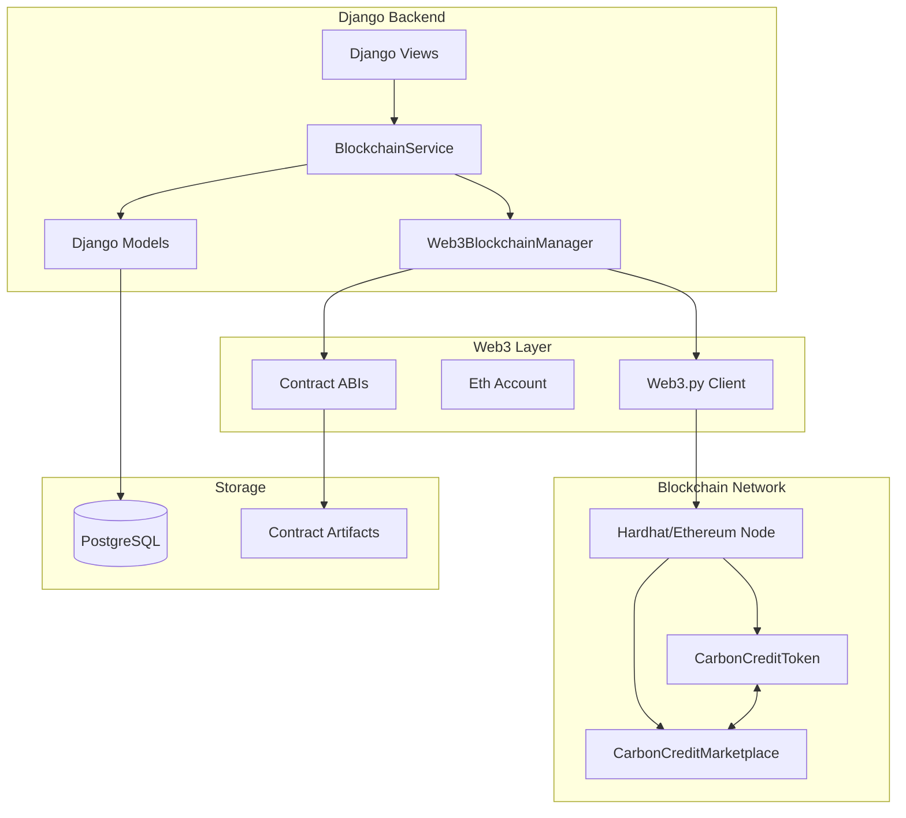
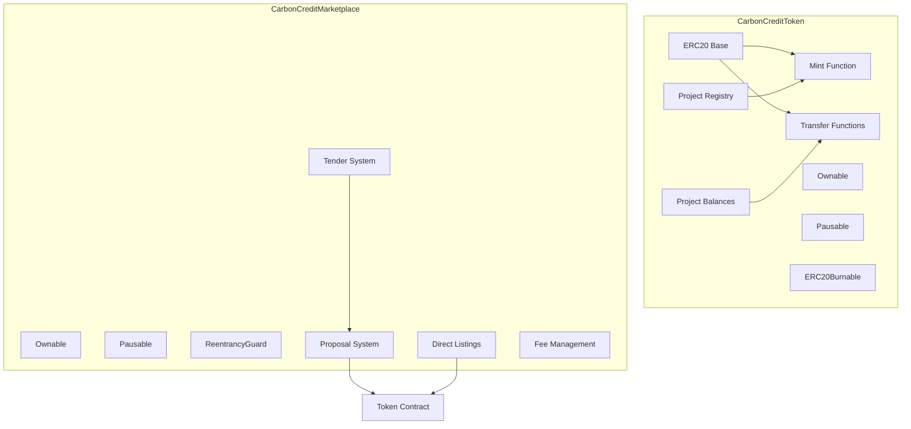
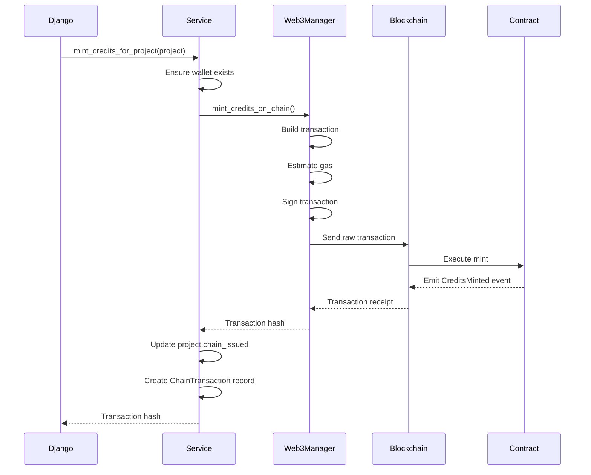
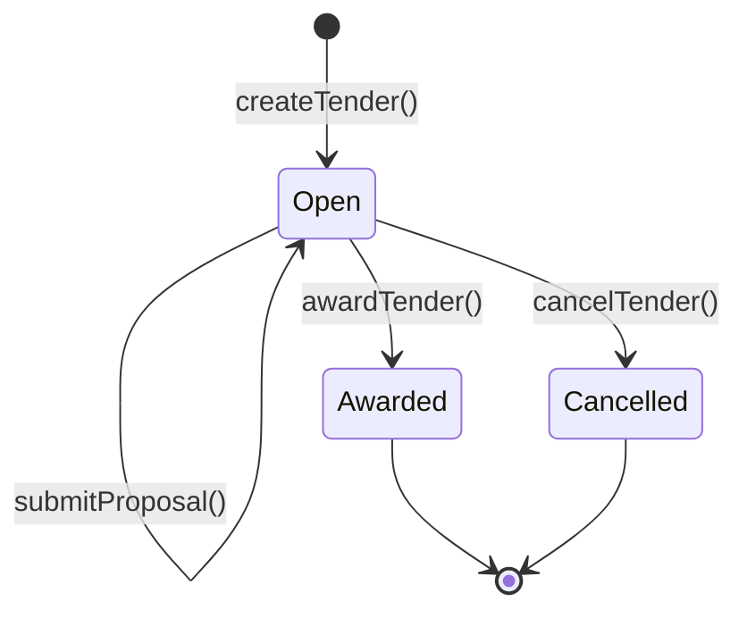
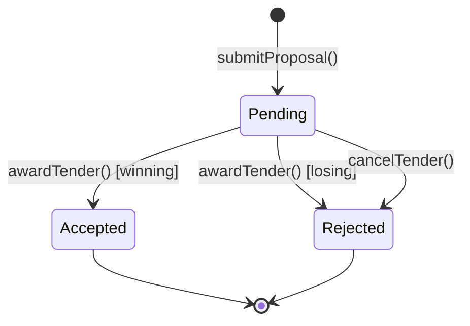

# Design Document

## Overview

The Blockchain Smart Contracts module implements a decentralized carbon credit trading system on Ethereum. The architecture consists of two primary smart contracts: CarbonCreditToken (ERC20 token for carbon credits) and CarbonCreditMarketplace (tender and trading system). The Django backend integrates via Web3.py through a service layer that abstracts blockchain complexity.

The system supports both local development (Hardhat network) and production deployments (Ethereum mainnet/testnets). A fallback simple blockchain provides functionality when smart contracts are unavailable.

## Architecture

### High-Level Architecture



### Smart Contract Architecture



### Transaction Flow Architecture



## Components and Interfaces

### Smart Contract Components

#### CarbonCreditToken Contract
- **Inheritance**: ERC20, Ownable, Pausable, ERC20Burnable
- **State Variables**:
  - `projects`: Mapping of project ID to Project struct
  - `userProjects`: Mapping of address to project IDs array
  - `userProjectCredits`: Nested mapping of address → project ID → balance
  - `nextProjectId`: Auto-incrementing project counter
  - `pricePerCredit`: ETH price for direct purchases

#### CarbonCreditMarketplace Contract
- **Inheritance**: Ownable, Pausable, ReentrancyGuard
- **State Variables**:
  - `carbonToken`: Reference to CarbonCreditToken contract
  - `tenders`: Mapping of tender ID to Tender struct
  - `proposals`: Mapping of proposal ID to Proposal struct
  - `directListings`: Mapping of listing ID to DirectListing struct
  - `marketplaceFeePercent`: Fee in basis points (default 250 = 2.5%)

### Backend Integration Components

#### Web3BlockchainManager
```python
class Web3BlockchainManager:
    def __init__(self):
        self.w3: Web3
        self.carbon_token_contract: Contract
        self.marketplace_contract: Contract
        self.account: Account
        self.config: BlockchainConfig
    
    def register_project_on_chain(project_name, ngo_address, estimated_credits) -> int
    def mint_credits_on_chain(recipient_address, amount, project_id) -> str
    def transfer_credits_on_chain(from_address, to_address, amount, project_id) -> str
    def get_balance(address) -> int
    def create_tender_on_chain(title, description, credits_required, max_price, duration_days) -> str
```

#### BlockchainService
```python
class BlockchainService:
    @staticmethod
    def register_project_on_blockchain(project: Project) -> Optional[str]
    
    @staticmethod
    def mint_credits_for_project(project: Project) -> Optional[str]
    
    @staticmethod
    def transfer_credits(from_user, to_user, amount, project_id) -> Optional[str]
    
    @staticmethod
    def get_user_balance(user: User) -> int
    
    @staticmethod
    def get_blockchain_status() -> Dict[str, Any]
```

### Key Interfaces

#### Contract Events Interface
```solidity
// CarbonCreditToken Events
event CreditsMinted(address indexed to, uint256 amount, uint256 projectId, string projectName);
event CreditsTransferred(address indexed from, address indexed to, uint256 amount, uint256 projectId);
event ProjectRegistered(uint256 indexed projectId, string name, address ngo, uint256 estimatedCredits);

// CarbonCreditMarketplace Events
event TenderCreated(uint256 indexed tenderId, address indexed corporate, uint256 creditsRequired, uint256 maxPrice);
event ProposalSubmitted(uint256 indexed tenderId, uint256 indexed proposalId, address indexed ngo, uint256 creditsOffered, uint256 pricePerCredit);
event TenderAwarded(uint256 indexed tenderId, uint256 indexed proposalId, address indexed winner);
event CreditsTraded(address indexed seller, address indexed buyer, uint256 amount, uint256 totalPrice, uint256 projectId);
```

## Data Models

### Smart Contract Data Structures

```solidity
struct Project {
    uint256 id;
    string name;
    address ngo;
    uint256 totalCreditsIssued;
    uint256 estimatedCredits;
    bool isActive;
    uint256 createdAt;
}

struct Tender {
    uint256 id;
    address corporate;
    string title;
    string description;
    uint256 creditsRequired;
    uint256 maxPricePerCredit;
    uint256 deadline;
    TenderStatus status;
    uint256 createdAt;
    uint256 winningProposalId;
}

struct Proposal {
    uint256 id;
    uint256 tenderId;
    address ngo;
    uint256 creditsOffered;
    uint256 pricePerCredit;
    uint256 projectId;
    string projectDescription;
    ProposalStatus status;
    uint256 submittedAt;
}

struct DirectListing {
    uint256 id;
    address seller;
    uint256 projectId;
    uint256 creditsAmount;
    uint256 pricePerCredit;
    bool isActive;
    uint256 createdAt;
}

enum TenderStatus { Open, UnderReview, Awarded, Cancelled }
enum ProposalStatus { Pending, Accepted, Rejected }
```

### Django Database Models

```python
class BlockchainConfig(models.Model):
    name: str
    network_type: str  # 'local', 'sepolia', 'mainnet'
    rpc_url: str
    chain_id: int
    private_key: str  # Encrypted
    carbon_token_address: str
    marketplace_address: str
    is_active: bool

class ChainTransaction(models.Model):
    sender: str
    recipient: str
    amount: Decimal
    project_id: int
    kind: str  # 'MINT', 'TRANSFER', 'ISSUE'
    tx_hash: str
    timestamp: datetime
    meta: JSONField
```

### State Machine: Tender Lifecycle



### State Machine: Proposal Lifecycle



## Correctness Properties

### Token Properties

**Property 1: Total Supply Consistency**
*For any* sequence of mint and burn operations, the total supply should equal the sum of all balances.
**Validates: Requirements 1.1, 1.2, 1.3**

**Property 2: Project Balance Consistency**
*For any* user and project, the sum of project-specific balances should not exceed the user's total balance.
**Validates: Requirements 1.4, 4.2**

**Property 3: Mint Authorization**
*For any* mint operation, only the contract owner should be able to execute it successfully.
**Validates: Requirements 1.2, 3.5**

**Property 4: Transfer Balance Preservation**
*For any* transfer operation, the sum of sender and recipient balances should remain constant.
**Validates: Requirements 4.1, 4.6**

### Project Properties

**Property 5: Project ID Uniqueness**
*For any* two registered projects, their IDs should be unique and sequential.
**Validates: Requirements 2.1**

**Property 6: Project Credit Tracking**
*For any* project, totalCreditsIssued should equal the sum of all minted credits for that project.
**Validates: Requirements 2.3, 3.4**

**Property 7: Inactive Project Protection**
*For any* inactive project, minting operations should be rejected.
**Validates: Requirements 2.7, 3.1**

### Marketplace Properties

**Property 8: Tender Deadline Enforcement**
*For any* proposal submission after tender deadline, the transaction should revert.
**Validates: Requirements 7.2**

**Property 9: Proposal Credit Verification**
*For any* proposal, the NGO must have sufficient project credits at submission time.
**Validates: Requirements 7.5**

**Property 10: Award Atomicity**
*For any* tender award, credit transfer and payment should both succeed or both fail.
**Validates: Requirements 8.4, 8.5**

**Property 11: Single Winner Per Tender**
*For any* awarded tender, exactly one proposal should have Accepted status.
**Validates: Requirements 8.7**

**Property 12: Fee Calculation Accuracy**
*For any* trade, the fee should be exactly (totalCost * marketplaceFeePercent) / 10000.
**Validates: Requirements 11.1, 11.6**

### Security Properties

**Property 13: Reentrancy Protection**
*For any* payment function, reentrancy attacks should be prevented by ReentrancyGuard.
**Validates: Requirements 12.3**

**Property 14: Pause Effectiveness**
*For any* paused contract, all state-changing operations should revert.
**Validates: Requirements 12.2**

**Property 15: Owner-Only Functions**
*For any* administrative function, non-owner calls should revert.
**Validates: Requirements 12.4, 12.5, 12.6**

## Error Handling

### Smart Contract Error Handling

```solidity
// Common require statements
require(projects[_projectId].isActive, "Project is not active");
require(_amount > 0, "Amount must be greater than 0");
require(tender.status == TenderStatus.Open, "Tender is not open");
require(block.timestamp < tender.deadline, "Tender deadline has passed");
require(msg.value >= totalCost, "Insufficient payment");
```

### Backend Error Handling

```python
class BlockchainError(Exception):
    """Base exception for blockchain operations"""
    pass

class ContractNotDeployedError(BlockchainError):
    """Raised when contracts are not deployed"""
    pass

class InsufficientCreditsError(BlockchainError):
    """Raised when user has insufficient credits"""
    pass

class TransactionFailedError(BlockchainError):
    """Raised when blockchain transaction fails"""
    pass
```

### Error Recovery Strategies

1. **Transaction Retry**: Automatic retry with increased gas for failed transactions
2. **Nonce Management**: Track and recover from nonce conflicts
3. **Connection Recovery**: Automatic reconnection to blockchain node
4. **Fallback Mode**: Use simple blockchain when contracts unavailable

## Testing Strategy

### Smart Contract Testing

#### Unit Tests (Hardhat/Chai)
```javascript
describe("CarbonCreditToken", function() {
    it("Should mint credits to recipient", async function() {
        await token.registerProject("Test Project", ngo.address, 1000);
        await token.mintCredits(ngo.address, 100, 1);
        expect(await token.balanceOf(ngo.address)).to.equal(100);
    });
    
    it("Should reject minting for inactive project", async function() {
        await token.deactivateProject(1);
        await expect(token.mintCredits(ngo.address, 100, 1))
            .to.be.revertedWith("Project is not active");
    });
});
```

#### Integration Tests
- Full tender lifecycle: create → propose → award
- Credit flow: mint → transfer → burn
- Marketplace: listing → purchase → settlement

### Backend Integration Testing

```python
class BlockchainServiceTests(TestCase):
    def test_mint_credits_creates_transaction(self):
        project = ProjectFactory(status='approved', credits=100)
        tx_hash = BlockchainService.mint_credits_for_project(project)
        
        self.assertIsNotNone(tx_hash)
        self.assertTrue(project.chain_issued)
        self.assertEqual(ChainTransaction.objects.filter(project_id=project.id).count(), 1)
    
    def test_transfer_updates_balances(self):
        # Test credit transfer between users
        pass
```

### Gas Optimization Testing

```javascript
describe("Gas Usage", function() {
    it("Should use reasonable gas for minting", async function() {
        const tx = await token.mintCredits(ngo.address, 100, 1);
        const receipt = await tx.wait();
        expect(receipt.gasUsed).to.be.lessThan(100000);
    });
});
```

## Deployment Configuration

### Hardhat Configuration

```javascript
module.exports = {
    solidity: {
        version: "0.8.20",
        settings: {
            optimizer: { enabled: true, runs: 200 }
        }
    },
    networks: {
        localhost: { url: "http://127.0.0.1:8545" },
        hardhat: { chainId: 1337 },
        sepolia: {
            url: process.env.SEPOLIA_URL,
            accounts: [process.env.PRIVATE_KEY]
        }
    }
};
```

### Deployment Script

```javascript
async function main() {
    // Deploy CarbonCreditToken
    const Token = await ethers.getContractFactory("CarbonCreditToken");
    const token = await Token.deploy();
    await token.waitForDeployment();
    
    // Deploy CarbonCreditMarketplace
    const Marketplace = await ethers.getContractFactory("CarbonCreditMarketplace");
    const marketplace = await Marketplace.deploy(await token.getAddress());
    await marketplace.waitForDeployment();
    
    // Save addresses
    console.log("Token:", await token.getAddress());
    console.log("Marketplace:", await marketplace.getAddress());
}
```

### Environment Configuration

```bash
# .env
SEPOLIA_URL=https://sepolia.infura.io/v3/YOUR_KEY
MAINNET_URL=https://mainnet.infura.io/v3/YOUR_KEY
PRIVATE_KEY=0x...
ETHERSCAN_API_KEY=...
REPORT_GAS=true
```

## Security Considerations

### Smart Contract Security

1. **Access Control**: All administrative functions protected by Ownable
2. **Reentrancy**: Payment functions protected by ReentrancyGuard
3. **Integer Overflow**: Solidity 0.8+ has built-in overflow protection
4. **Pausability**: Emergency stop mechanism for all operations
5. **Input Validation**: All inputs validated before state changes

### Backend Security

1. **Private Key Storage**: Encrypted storage in database
2. **Transaction Signing**: Server-side signing only
3. **Address Validation**: Checksum validation for all addresses
4. **Rate Limiting**: Prevent transaction spam
5. **Audit Logging**: All blockchain operations logged

### Recommended Audits

1. Static analysis with Slither
2. Formal verification for critical functions
3. Third-party security audit before mainnet deployment
4. Continuous monitoring with OpenZeppelin Defender
