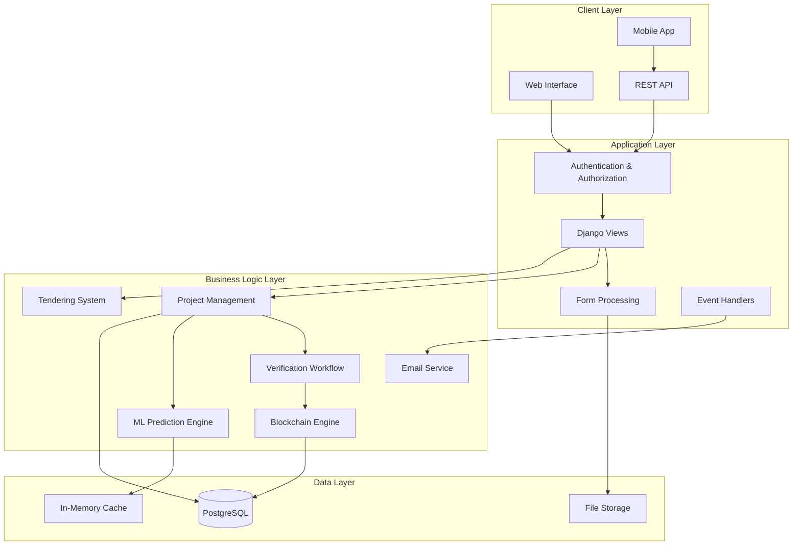
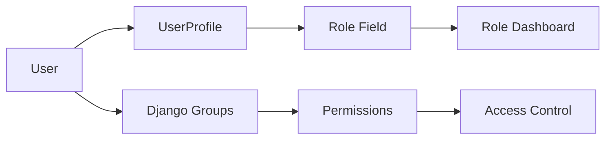
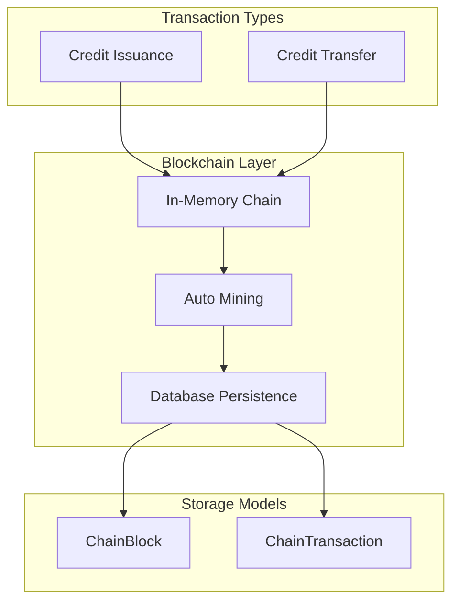
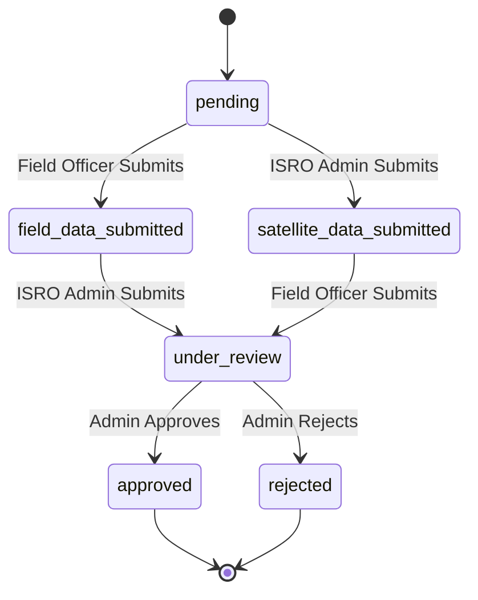
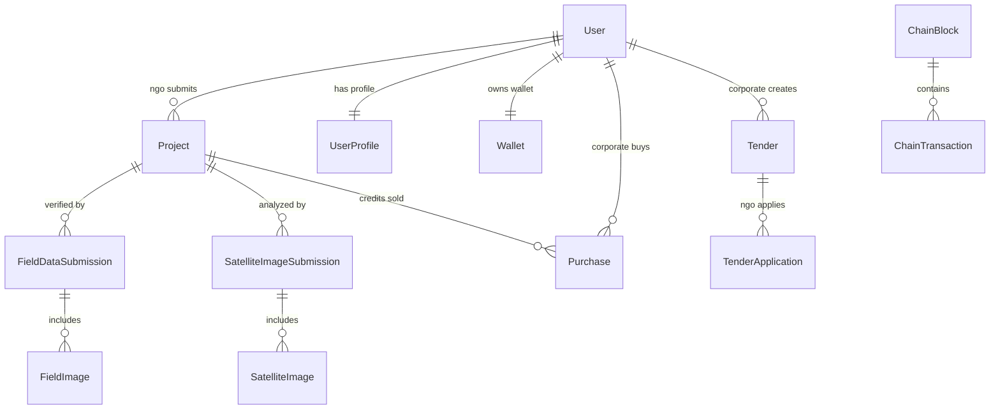

# Design Document

## Overview

The Carbon Credit Marketplace is a Django-based web application that facilitates the complete lifecycle of carbon credit projects from submission to trading. The system implements a multi-role architecture supporting NGOs, corporations, administrators, field officers, and ISRO satellite data administrators. It features an integrated blockchain for transaction transparency, ML-based credit prediction, and comprehensive project verification workflows.

The architecture follows Django's Model-View-Template (MVT) pattern with role-based access control, RESTful API endpoints for mobile integration, and a custom blockchain implementation for credit tracking. The system emphasizes data integrity, security, and scalability while maintaining backward compatibility with legacy authentication systems.

## Architecture

### High-Level Architecture



### Role-Based Access Control Architecture

The system implements a hybrid approach combining Django's built-in Groups with custom UserProfile models:



### Blockchain Architecture

The system implements a simplified blockchain for demonstration purposes with persistent storage:



## Components and Interfaces

### Core Models

#### User Management Models
- **User**: Django's built-in User model extended with UserProfile
- **UserProfile**: Role-specific information and metadata
- **Wallet**: Blockchain addresses for credit transactions
- **Legacy Login Models**: Backward compatibility (NGOLogin, CorporateLogin, etc.)

#### Project Management Models
- **Project**: Core project entity with workflow status tracking
- **FieldDataSubmission**: On-site verification data from field officers
- **FieldImage**: Images associated with field submissions
- **SatelliteImageSubmission**: Remote sensing data from ISRO admins
- **SatelliteImage**: Satellite imagery files

#### Transaction Models
- **Purchase**: Credit purchase records linking corporates to projects
- **ChainBlock**: Blockchain block persistence
- **ChainTransaction**: Individual blockchain transactions

#### Tendering Models
- **Tender/TenderV2**: Corporate requests for carbon credits
- **TenderApplication/ProposalV2**: NGO responses to tenders

### Key Interfaces

#### Authentication Interface
```python
class AuthenticationMixin:
    def get_user_role(user: User) -> str
    def ensure_user_profile(user: User) -> UserProfile
    def check_role_permission(user: User, required_role: str) -> bool
```

#### Blockchain Interface
```python
class BlockchainEngine:
    def issue_credits(recipient: str, amount: float, project_id: int)
    def transfer_credits(sender: str, recipient: str, amount: float, project_id: int)
    def get_chain() -> List[dict]
    def new_block(nonce: int, previous_hash: str) -> dict
```

#### ML Prediction Interface
```python
class MLPredictor:
    def predict_credits(area: float, image_path: str) -> int
    def predict_details(area: float, image_path: str) -> dict
    def extract_features(image_path: str) -> dict
```

#### Email Service Interface
```python
class EmailService:
    def send_templated_email(subject: str, template: str, context: dict, recipients: list)
    def render_certificate_pdf(purchase: Purchase) -> str
    def send_otp_email(email: str, code: str)
```

## Data Models

### Project Workflow State Machine



### Database Schema Key Relationships



### File Storage Organization

```
media/
├── documents/           # Project documents from NGOs
├── field_images/        # Field verification photos
├── satellite_images/    # Satellite imagery files
├── certificates/        # Generated purchase certificates
├── tenders/
│   └── proposals/       # Tender proposal documents
└── corporate_docs/      # Corporate registration documents
```

## Correctness Properties

*A property is a characteristic or behavior that should hold true across all valid executions of a system-essentially, a formal statement about what the system should do. Properties serve as the bridge between human-readable specifications and machine-verifiable correctness guarantees.*

Based on the prework analysis, nearly all acceptance criteria are testable as properties since they involve verifiable system behaviors. Here are the key correctness properties:

### User Management Properties

**Property 1: Role Assignment Consistency**
*For any* user registration with a specified role, the system should create a UserProfile with that role and assign the user to the corresponding Django group.
**Validates: Requirements 1.1, 1.2**

**Property 2: Wallet Uniqueness**
*For any* two users in the system, their wallet addresses should be unique and non-null.
**Validates: Requirements 1.5, 7.4**

**Property 3: Role-Based Dashboard Routing**
*For any* authenticated user, login should redirect to the dashboard URL corresponding to their role.
**Validates: Requirements 1.6**

**Property 4: OTP Verification Requirement**
*For any* NGO registration attempt, the registration should fail unless both email and phone OTP verification are completed.
**Validates: Requirements 1.3**

**Property 5: Corporate Email Domain Validation**
*For any* corporate registration with a personal email domain (gmail.com, yahoo.com, etc.), the registration should be rejected.
**Validates: Requirements 1.4**

### Project Management Properties

**Property 6: Project Status Initialization**
*For any* newly submitted project, the initial status should be "pending".
**Validates: Requirements 2.3**

**Property 7: Required Field Validation**
*For any* project submission missing title, location, species, area, or document, the submission should be rejected.
**Validates: Requirements 2.1**

**Property 8: Project Workflow State Transitions**
*For any* project, status transitions should follow the defined state machine: pending → field_data_submitted/satellite_data_submitted → under_review → approved/rejected.
**Validates: Requirements 2.5**

**Property 9: File Storage Organization**
*For any* uploaded file, it should be stored in the appropriate media subdirectory based on file type and be retrievable via its stored path.
**Validates: Requirements 2.4, 13.2**

### ML Prediction Properties

**Property 10: Credit Calculation Consistency**
*For any* project with the same area and image features, the ML model should produce consistent credit predictions across multiple calls.
**Validates: Requirements 3.3**

**Property 11: Feature Extraction Determinism**
*For any* image file, feature extraction should produce the same feature values when called multiple times.
**Validates: Requirements 3.2**

**Property 12: Model Availability**
*For any* system startup, the ML model should load successfully and be available for predictions.
**Validates: Requirements 3.1**

### Verification Workflow Properties

**Property 13: Field Data Completeness**
*For any* field data submission, it should require survey date, GPS coordinates, area measurements, and at least one species entry.
**Validates: Requirements 4.1, 4.3**

**Property 14: Duplicate Submission Prevention**
*For any* project that already has field data, attempting to submit additional field data should be rejected.
**Validates: Requirements 4.6**

**Property 15: Status Transition on Data Submission**
*For any* project in "pending" status, submitting field data should change status to "field_data_submitted", and submitting satellite data should change status to "satellite_data_submitted".
**Validates: Requirements 4.5, 5.3**

**Property 16: Dual Verification Requirement**
*For any* project with both field and satellite data, the status should automatically advance to "under_review".
**Validates: Requirements 5.4**

**Property 17: Admin Review Preconditions**
*For any* admin approval/rejection action, both field and satellite data must be present, otherwise the action should be blocked.
**Validates: Requirements 6.1**

### Blockchain Properties

**Property 18: Credit Issuance Transaction Creation**
*For any* approved project, credit issuance should create an "ISSUE" transaction from "SYSTEM" to the NGO's wallet address with the calculated credit amount.
**Validates: Requirements 6.3, 7.2**

**Property 19: Purchase Transaction Creation**
*For any* credit purchase, a "TRANSFER" transaction should be created from the corporate wallet to the NGO wallet with the purchased amount.
**Validates: Requirements 7.3, 8.3**

**Property 20: Blockchain Persistence**
*For any* blockchain transaction, it should be persisted to the database and survive application restarts.
**Validates: Requirements 7.1**

### Marketplace Properties

**Property 21: Marketplace Filtering**
*For any* corporate user viewing the marketplace, only projects with status "approved" and credits > 0 should be displayed.
**Validates: Requirements 8.1**

**Property 22: Purchase Inventory Validation**
*For any* purchase attempt, if the requested credits exceed available credits, the purchase should be rejected.
**Validates: Requirements 8.2**

**Property 23: Purchase Completion Effects**
*For any* successful purchase, the project's available credits should decrease by the purchased amount and a blockchain transfer should be recorded.
**Validates: Requirements 8.3**

### Tendering Properties

**Property 24: Tender Creation Validation**
*For any* tender creation, title, credit requirements, and description should be required fields.
**Validates: Requirements 9.1**

**Property 25: Proposal Completeness**
*For any* tender application, offered credits, price per credit, and project description should be required.
**Validates: Requirements 9.2**

**Property 26: Tender Resolution Atomicity**
*For any* proposal acceptance, the tender status should change to "Closed" and all other proposals should be marked "Rejected".
**Validates: Requirements 9.3**

### Communication Properties

**Property 27: Approval Notification**
*For any* project approval, an email should be sent to the NGO's email address containing credit issuance details.
**Validates: Requirements 10.1**

**Property 28: Purchase Notification**
*For any* credit purchase, emails should be sent to both the corporate buyer and NGO seller with transaction details.
**Validates: Requirements 10.2**

### Certificate Properties

**Property 29: Certificate Generation**
*For any* certificate request for a valid purchase, a PDF file should be generated and stored with the purchase details.
**Validates: Requirements 11.1**

**Property 30: Certificate Content Completeness**
*For any* generated certificate, it should contain company name, NGO name, credit amount, CO2 equivalent, and certificate ID.
**Validates: Requirements 11.2**

### Security Properties

**Property 31: Role-Based Access Control**
*For any* endpoint requiring specific role permissions, requests from users without the required role should be rejected with appropriate HTTP status codes.
**Validates: Requirements 14.1**

**Property 32: File Upload Security**
*For any* file upload, files with dangerous extensions (.exe, .bat, .sh, etc.) should be rejected.
**Validates: Requirements 14.2**

### Mobile API Properties

**Property 33: Token Authentication**
*For any* mobile API request with a valid token, the request should be authenticated to the token's associated user.
**Validates: Requirements 12.1**

**Property 34: Mobile Project Submission**
*For any* mobile project submission with valid multipart data, the project should be created with the same validation rules as web submissions.
**Validates: Requirements 12.2**

<function_calls>
<invoke name="prework">
<parameter name="featureName">carbon-credit-marketplace

## Error Handling

### Exception Handling Strategy

The system implements comprehensive error handling across all layers:

#### Database Errors
- **Connection Failures**: Graceful degradation with retry logic and user-friendly error messages
- **Constraint Violations**: Proper validation before database operations to prevent integrity errors
- **Migration Failures**: Rollback mechanisms and safe migration practices

#### File Upload Errors
- **Size Limits**: Configurable file size limits with clear error messages
- **Format Validation**: MIME type checking and file extension validation
- **Storage Failures**: Fallback storage options and error recovery

#### ML Model Errors
- **Model Loading Failures**: Graceful fallback when ML model is unavailable
- **Prediction Errors**: Default credit calculations when ML predictions fail
- **Feature Extraction Errors**: Error handling for corrupted or invalid images

#### Blockchain Errors
- **Transaction Failures**: Retry mechanisms and transaction rollback
- **Block Mining Errors**: Error recovery and chain consistency checks
- **Persistence Failures**: Fallback to in-memory operations with warning logs

#### Email Service Errors
- **SMTP Failures**: Graceful degradation with retry logic and admin notifications
- **Template Errors**: Fallback to plain text emails when HTML rendering fails
- **Certificate Generation Errors**: Multiple PDF generation library fallbacks

#### API Error Responses
```python
# Standard error response format
{
    "error": "error_code",
    "message": "Human-readable error message",
    "details": {
        "field_errors": {...},
        "validation_errors": [...]
    },
    "timestamp": "2024-01-01T00:00:00Z"
}
```

### Logging Strategy

- **Security Events**: Authentication failures, unauthorized access attempts
- **Business Logic**: Project status changes, credit transactions, tender activities
- **System Events**: Database connections, file operations, email sending
- **Error Events**: All exceptions with full stack traces and context

## Testing Strategy

### Dual Testing Approach

The system requires both unit testing and property-based testing for comprehensive coverage:

#### Unit Tests
Unit tests focus on specific examples, edge cases, and integration points:
- **Authentication flows**: Login/logout, registration, OTP verification
- **Form validation**: Specific validation rules and error cases
- **File upload handling**: Various file types and sizes
- **Email template rendering**: Specific template contexts
- **Certificate generation**: PDF creation with various data inputs
- **API endpoint responses**: Specific request/response scenarios

#### Property-Based Tests
Property tests verify universal properties across all inputs using **Hypothesis** for Python:
- **Minimum 100 iterations** per property test for thorough coverage
- **Custom generators** for domain-specific data (projects, users, transactions)
- **Stateful testing** for workflow sequences (project submission → verification → approval)
- **Database consistency** properties across transactions

#### Property Test Configuration
Each property test must include:
```python
@given(...)
@settings(max_examples=100, deadline=None)
def test_property_name(self, ...):
    """
    Feature: carbon-credit-marketplace, Property X: [Property description]
    Validates: Requirements X.Y, X.Z
    """
```

#### Test Data Management
- **Factory classes** for generating test objects with realistic data
- **Fixture management** for database state setup and teardown
- **Mock services** for external dependencies (email, file storage)
- **Test database isolation** to prevent test interference

#### Integration Testing
- **End-to-end workflows**: Complete project lifecycle from submission to purchase
- **Role-based access testing**: Verify permissions across all user types
- **API integration**: Mobile API compatibility and response formats
- **Blockchain consistency**: Transaction ordering and persistence

#### Performance Testing
- **Load testing**: Concurrent user scenarios and database performance
- **File upload limits**: Large file handling and storage efficiency
- **ML model performance**: Prediction latency and memory usage
- **Email queue processing**: Bulk notification handling

### Testing Tools and Libraries

#### Core Testing Framework
- **Django TestCase**: Database-backed tests with transaction rollback
- **pytest-django**: Enhanced test discovery and fixtures
- **factory_boy**: Test data generation with realistic relationships

#### Property-Based Testing
- **Hypothesis**: Property-based test generation and shrinking
- **hypothesis-django**: Django model integration and database strategies

#### Mock and Stub Libraries
- **unittest.mock**: Python standard library mocking
- **responses**: HTTP request mocking for external API calls
- **django-override-settings**: Configuration override for testing

#### Coverage and Quality
- **coverage.py**: Code coverage measurement and reporting
- **pytest-cov**: Coverage integration with pytest
- **django-debug-toolbar**: Development debugging and profiling

### Continuous Integration

#### Test Automation Pipeline
1. **Code Quality Checks**: Linting, formatting, security scanning
2. **Unit Test Execution**: Fast feedback on individual components
3. **Property Test Execution**: Comprehensive behavior verification
4. **Integration Test Execution**: End-to-end workflow validation
5. **Coverage Reporting**: Ensure adequate test coverage (>90%)
6. **Performance Benchmarks**: Regression detection for critical paths

#### Test Environment Management
- **Database migrations**: Automated schema updates in test environments
- **Test data seeding**: Consistent baseline data for integration tests
- **Service dependencies**: Mock external services for reliable testing
- **Parallel execution**: Optimized test runtime with parallel test runners

This comprehensive testing strategy ensures system reliability, correctness, and maintainability while providing confidence in the complex multi-role workflow and blockchain integration features.