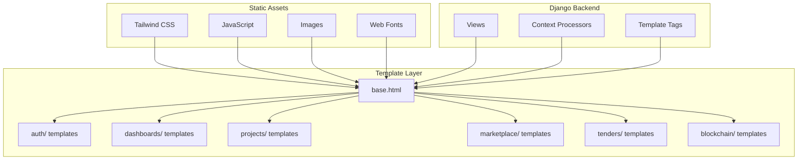
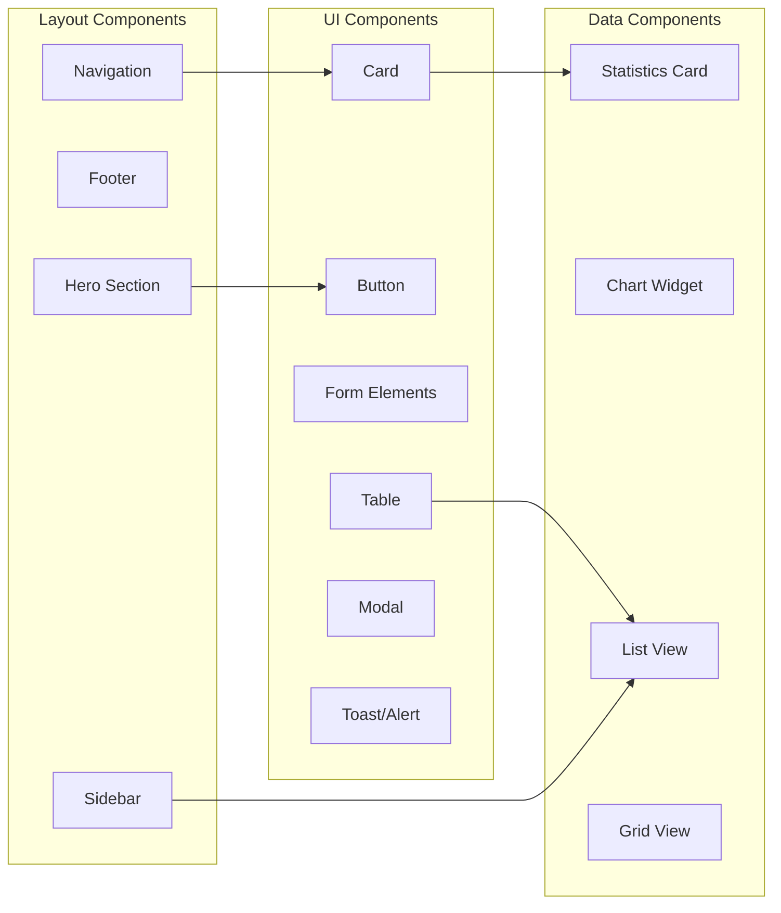

# Design Document

## Overview

The Frontend Web Design module implements a modern, responsive user interface for the Carbon Credit Marketplace using Django templates, Tailwind CSS, and vanilla JavaScript. The design system emphasizes glass morphism aesthetics, smooth animations, and role-based experiences. The architecture follows Django's template inheritance pattern with reusable components and consistent styling across all pages.

The frontend supports five distinct user roles (NGO, Corporate, Admin, Field Officer, ISRO Admin) with tailored dashboards and workflows. The design prioritizes accessibility, mobile responsiveness, and performance.

## Architecture

### High-Level Architecture



### Template Inheritance Structure

```mermaid
graph TD
    BASE[base.html] --> HOME[home/index.html]
    BASE --> ABOUT[about.html]
    BASE --> AUTH_BASE[auth/base_auth.html]
    BASE --> DASH_NGO[dashboards/ngo.html]
    BASE --> DASH_CORP[dashboards/corporate.html]
    BASE --> DASH_ADMIN[dashboards/admin.html]
    BASE --> DASH_FIELD[dashboards/field_officer.html]
    BASE --> DASH_ISRO[dashboards/isro_admin.html]
    
    AUTH_BASE --> LOGIN[auth/login_*.html]
    AUTH_BASE --> REGISTER[auth/register_*.html]
    
    BASE --> PROJ_LIST[projects/list.html]
    BASE --> PROJ_DETAIL[projects/detail.html]
    BASE --> PROJ_CREATE[projects/create.html]
    
    BASE --> MARKET_LIST[marketplace/list.html]
    BASE --> MARKET_DETAIL[marketplace/detail.html]
    BASE --> MARKET_PURCHASE[marketplace/purchase.html]
```



### Component Architecture



## Components and Interfaces

### Design System Tokens

#### Color Palette
```css
:root {
    /* Primary - Sky Blue */
    --primary-50: #f0f9ff;
    --primary-100: #e0f2fe;
    --primary-500: #0ea5e9;
    --primary-600: #0284c7;
    --primary-700: #0369a1;
    --primary-900: #0c4a6e;
    
    /* Accent - Green */
    --accent-50: #f0fdf4;
    --accent-500: #22c55e;
    --accent-600: #16a34a;
    --accent-700: #15803d;
    
    /* Neutral */
    --neutral-50: #fafafa;
    --neutral-100: #f5f5f5;
    --neutral-500: #737373;
    --neutral-700: #404040;
    --neutral-900: #171717;
    
    /* Gradients */
    --primary-gradient: linear-gradient(135deg, #0ea5e9 0%, #0369a1 100%);
    --accent-gradient: linear-gradient(135deg, #22c55e 0%, #15803d 100%);
    --card-gradient: linear-gradient(135deg, rgba(255,255,255,0.9) 0%, rgba(248,250,252,0.8) 100%);
}
```

#### Typography Scale
```css
/* Font Families */
--font-inter: 'Inter', sans-serif;
--font-mono: 'JetBrains Mono', monospace;
--font-julius: 'Julius Sans One', sans-serif;
--font-jockey: 'Jockey One', sans-serif;
--font-javanese: 'Javanese Text', serif;

/* Font Sizes */
--text-xs: 0.75rem;    /* 12px */
--text-sm: 0.875rem;   /* 14px */
--text-base: 1rem;     /* 16px */
--text-lg: 1.125rem;   /* 18px */
--text-xl: 1.25rem;    /* 20px */
--text-2xl: 1.5rem;    /* 24px */
--text-3xl: 1.875rem;  /* 30px */
--text-4xl: 2.25rem;   /* 36px */
--text-5xl: 3rem;      /* 48px */
--text-7xl: 4.5rem;    /* 72px */
```

#### Spacing Scale
```css
/* Tailwind default spacing */
--space-1: 0.25rem;   /* 4px */
--space-2: 0.5rem;    /* 8px */
--space-4: 1rem;      /* 16px */
--space-6: 1.5rem;    /* 24px */
--space-8: 2rem;      /* 32px */
--space-10: 2.5rem;   /* 40px */
--space-12: 3rem;     /* 48px */
--space-16: 4rem;     /* 64px */
```

### Key UI Components

#### Navigation Component
```html
<header class="nav-on-hero nav-shimmer sticky top-0 z-40">
    <div class="max-w-7xl mx-auto px-6 lg:px-8">
        <div class="flex items-center justify-between h-16">
            <!-- Logo -->
            <a href="/" class="flex items-center group">
                <div class="w-12 h-12 relative">
                    <!-- Hexagonal logo with gradient -->
                </div>
                <span class="ml-3 text-2xl font-bold brand-text">BlueQuant</span>
            </a>
            
            <!-- Desktop Navigation -->
            <nav class="hidden lg:block">
                <div class="flex space-x-1">
                    <a href="/" class="nav-link">Home</a>
                    <!-- Role-specific links -->
                </div>
            </nav>
            
            <!-- Mobile Menu Button -->
            <button id="mobile-menu-button" class="lg:hidden">
                <!-- Hamburger icon -->
            </button>
        </div>
    </div>
</header>
```

#### Card Component
```html
<div class="modern-card rounded-2xl p-6 card-hover">
    <div class="flex items-center justify-between mb-4">
        <h3 class="text-lg font-semibold text-neutral-800">Card Title</h3>
        <span class="status-badge">Status</span>
    </div>
    <p class="text-neutral-600 mb-4">Card content description.</p>
    <div class="flex justify-end">
        <button class="btn-primary px-4 py-2 rounded-lg">Action</button>
    </div>
</div>
```

#### Glass Surface Component
```html
<div class="glass-surface rounded-2xl p-8">
    <!-- Content with frosted glass effect -->
</div>

<div class="glass-surface-strong rounded-3xl p-14">
    <!-- Stronger glass effect for hero sections -->
</div>
```

#### Form Input Component
```html
<div class="mb-4">
    <label class="block text-sm font-medium text-neutral-700 mb-2">
        Field Label
    </label>
    <input type="text" 
           class="w-full px-4 py-3 border border-neutral-300 rounded-lg 
                  focus:ring-2 focus:ring-primary-500 focus:border-primary-500
                  input-focus-glow transition-all duration-200"
           placeholder="Enter value">
    <p class="mt-1 text-sm text-red-600 hidden">Error message</p>
</div>
```

#### Statistics Card Component
```html
<div class="bg-white rounded-xl p-6 shadow-card">
    <div class="flex items-center">
        <div class="w-12 h-12 bg-primary-100 rounded-lg flex items-center justify-center">
            <svg class="w-6 h-6 text-primary-600"><!-- Icon --></svg>
        </div>
        <div class="ml-4">
            <p class="text-sm text-neutral-500">Metric Label</p>
            <p class="text-2xl font-bold text-neutral-900">1,234</p>
        </div>
    </div>
</div>
```

### Page Layouts

#### Hero Page Layout (Home, About)
```html
<div class="relative text-white">
    <!-- Fixed background -->
    <div class="fixed inset-0 hero-bg hero-bg-fixed"></div>
    <div class="fixed inset-0 hero-overlay"></div>
    
    <!-- Content -->
    <div class="relative z-10">
        <section class="min-h-screen flex items-center justify-center">
            <!-- Hero content -->
        </section>
        
        <section class="py-16 md:py-24">
            <div class="max-w-7xl mx-auto px-6">
                <div class="glass-surface-strong rounded-3xl p-8 md:p-14">
                    <!-- Section content -->
                </div>
            </div>
        </section>
    </div>
</div>
```

#### Dashboard Layout
```html
<div class="min-h-screen bg-neutral-50">
    <div class="max-w-7xl mx-auto px-6 py-8">
        <!-- Welcome Header -->
        <div class="mb-8">
            <h1 class="text-3xl font-bold text-neutral-900">Welcome, {{ user.name }}</h1>
            <p class="text-neutral-600">Your dashboard overview</p>
        </div>
        
        <!-- Statistics Grid -->
        <div class="grid grid-cols-1 md:grid-cols-2 lg:grid-cols-4 gap-6 mb-8">
            <!-- Stat cards -->
        </div>
        
        <!-- Main Content Grid -->
        <div class="grid grid-cols-1 lg:grid-cols-3 gap-6">
            <div class="lg:col-span-2">
                <!-- Primary content -->
            </div>
            <div>
                <!-- Sidebar content -->
            </div>
        </div>
    </div>
</div>
```

#### Auth Page Layout
```html
<div class="min-h-screen auth-bg auth-bg-fixed flex items-center justify-center">
    <div class="w-full max-w-md mx-4">
        <div class="bg-white/95 backdrop-blur-lg rounded-2xl shadow-xl p-8 login-card-hover">
            <!-- Role indicator -->
            <div class="text-center mb-6">
                <div class="w-16 h-16 mx-auto bg-primary-100 rounded-full flex items-center justify-center">
                    <svg class="w-8 h-8 text-primary-600"><!-- Role icon --></svg>
                </div>
                <h2 class="mt-4 text-2xl font-bold gradient-text">Sign In</h2>
                <p class="text-neutral-600">Role: Contributor</p>
            </div>
            
            <!-- Login form -->
            <form method="post">
                <!-- Form fields -->
            </form>
        </div>
    </div>
</div>
```

## Animation System

### Keyframe Definitions
```css
@keyframes slideUp {
    from { opacity: 0; transform: translateY(30px); }
    to { opacity: 1; transform: translateY(0); }
}

@keyframes fadeIn {
    from { opacity: 0; }
    to { opacity: 1; }
}

@keyframes modalFadeIn {
    from { opacity: 0; transform: scale(0.95) translateY(20px); }
    to { opacity: 1; transform: scale(1) translateY(0); }
}

@keyframes shimmer {
    0% { transform: translateX(-100%); }
    100% { transform: translateX(100%); }
}

@keyframes float {
    0%, 100% { transform: translateY(0px) rotate(0deg); }
    33% { transform: translateY(-10px) rotate(1deg); }
    66% { transform: translateY(5px) rotate(-1deg); }
}

@keyframes glow-pulse {
    0%, 100% { box-shadow: 0 0 20px rgba(14, 165, 233, 0.3); }
    50% { box-shadow: 0 0 40px rgba(14, 165, 233, 0.5); }
}
```

### Animation Classes
```css
.page-enter { animation: slideUp 0.6s cubic-bezier(0.4, 0, 0.2, 1); }
.card-enter { animation: slideUp 0.6s cubic-bezier(0.4, 0, 0.2, 1); }
.message-enter { animation: slideUp 0.5s cubic-bezier(0.4, 0, 0.2, 1); }
.modal-content { animation: modalFadeIn 0.4s ease-out 0.1s both; }
.floating-element { animation: float 6s ease-in-out infinite; }
.login-card-hover { animation: glow-pulse 4s ease-in-out infinite; }
```

### Reduced Motion Support
```css
@media (prefers-reduced-motion: reduce) {
    .modal-content,
    .modal-backdrop,
    .skeleton,
    .loading-pulse,
    .card-hover {
        animation: none;
        transition: none;
    }
}
```

## Responsive Design

### Breakpoint System
```css
/* Tailwind default breakpoints */
sm: 640px   /* Small devices */
md: 768px   /* Medium devices */
lg: 1024px  /* Large devices */
xl: 1280px  /* Extra large devices */
2xl: 1536px /* 2X large devices */
```

### Mobile-First Patterns
```html
<!-- Grid that stacks on mobile -->
<div class="grid grid-cols-1 md:grid-cols-2 lg:grid-cols-4 gap-6">
    <!-- Items -->
</div>

<!-- Navigation visibility -->
<nav class="hidden lg:block"><!-- Desktop nav --></nav>
<button class="lg:hidden"><!-- Mobile menu button --></button>

<!-- Responsive padding -->
<div class="px-4 md:px-6 lg:px-8">
    <!-- Content -->
</div>

<!-- Responsive text -->
<h1 class="text-3xl md:text-5xl lg:text-7xl">
    Heading
</h1>
```

### Touch-Friendly Interactions
```css
@media (hover: none) and (pointer: coarse) {
    .card-hover:hover {
        transform: none;
    }
    
    .card-hover:active {
        transform: translateY(-1px);
        transition-duration: 0.1s;
    }
}
```

## JavaScript Interactions

### Mobile Menu Toggle
```javascript
document.addEventListener('DOMContentLoaded', function() {
    const menuButton = document.getElementById('mobile-menu-button');
    const mobileMenu = document.getElementById('mobile-menu');
    const menuIcon = document.getElementById('menu-icon');
    const closeIcon = document.getElementById('close-icon');
    
    menuButton.addEventListener('click', function() {
        mobileMenu.classList.toggle('active');
        menuIcon.classList.toggle('hidden');
        closeIcon.classList.toggle('hidden');
    });
});
```

### Dropdown Menu
```javascript
const dropdownBtn = document.getElementById('signinDropdownBtn');
const dropdown = document.getElementById('signinDropdown');
const caret = document.getElementById('signinDropdownCaret');

dropdownBtn.addEventListener('click', function(e) {
    e.stopPropagation();
    dropdown.classList.toggle('hidden');
    caret.classList.toggle('rotate-180');
});

document.addEventListener('click', function() {
    dropdown.classList.add('hidden');
    caret.classList.remove('rotate-180');
});
```

### Form Validation
```javascript
function validateForm(form) {
    let isValid = true;
    const inputs = form.querySelectorAll('input[required]');
    
    inputs.forEach(input => {
        const errorEl = input.nextElementSibling;
        if (!input.value.trim()) {
            input.classList.add('border-red-500');
            errorEl?.classList.remove('hidden');
            isValid = false;
        } else {
            input.classList.remove('border-red-500');
            errorEl?.classList.add('hidden');
        }
    });
    
    return isValid;
}
```

### Toast Notifications
```javascript
function showToast(message, type = 'success') {
    const toast = document.createElement('div');
    toast.className = `message-enter fixed top-4 right-4 px-6 py-4 rounded-lg shadow-lg z-50
        ${type === 'success' ? 'bg-accent-500 text-white' : 'bg-red-500 text-white'}`;
    toast.textContent = message;
    
    document.body.appendChild(toast);
    
    setTimeout(() => {
        toast.style.opacity = '0';
        setTimeout(() => toast.remove(), 300);
    }, 3000);
}
```

## Accessibility Guidelines

### ARIA Labels
```html
<button aria-label="Open navigation menu" aria-expanded="false">
    <svg aria-hidden="true"><!-- Icon --></svg>
</button>

<nav aria-label="Main navigation">
    <!-- Navigation links -->
</nav>

<main role="main" aria-label="Page content">
    <!-- Main content -->
</main>
```

### Focus Management
```css
/* Visible focus indicators */
:focus-visible {
    outline: 2px solid var(--primary-500);
    outline-offset: 2px;
}

/* Skip link for keyboard users */
.skip-link {
    position: absolute;
    top: -40px;
    left: 0;
    padding: 8px;
    background: var(--primary-500);
    color: white;
    z-index: 100;
}

.skip-link:focus {
    top: 0;
}
```

### Color Contrast
- Text on light backgrounds: minimum 4.5:1 ratio
- Large text: minimum 3:1 ratio
- Interactive elements: minimum 3:1 ratio against adjacent colors

## Performance Optimization

### Image Optimization
```html
<!-- Lazy loading -->


<!-- Responsive images -->

```

### CSS Optimization
- Use Tailwind's purge to remove unused styles
- Minimize custom CSS
- Use CSS custom properties for theming
- Avoid expensive selectors

### JavaScript Optimization
- Defer non-critical scripts
- Use event delegation
- Minimize DOM manipulation
- Lazy load components when possible

## Testing Strategy

### Visual Testing
- Cross-browser testing (Chrome, Firefox, Safari, Edge)
- Responsive testing at all breakpoints
- Dark mode compatibility (future)
- Print stylesheet testing

### Accessibility Testing
- Keyboard navigation testing
- Screen reader testing (NVDA, VoiceOver)
- Color contrast validation
- ARIA attribute validation

### Performance Testing
- Lighthouse audits
- Core Web Vitals monitoring
- Load time benchmarking
- Bundle size analysis
